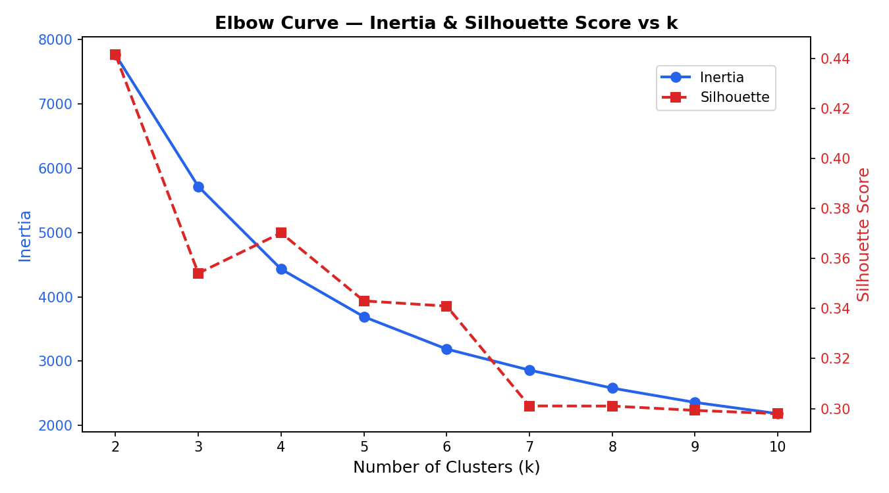
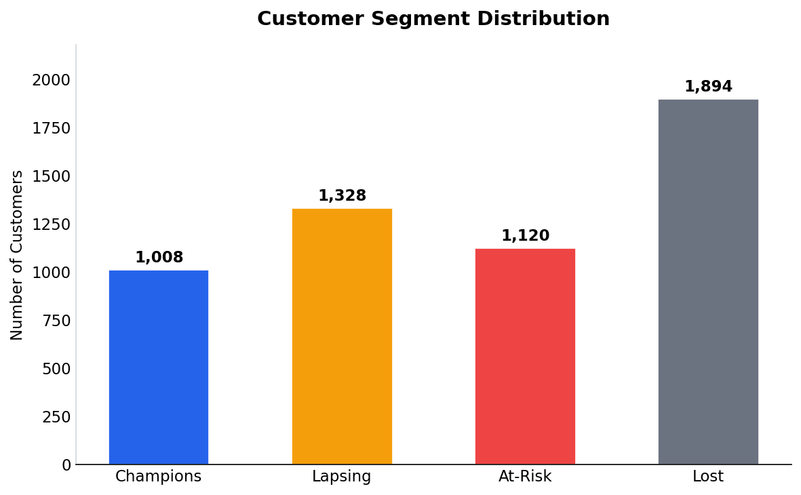
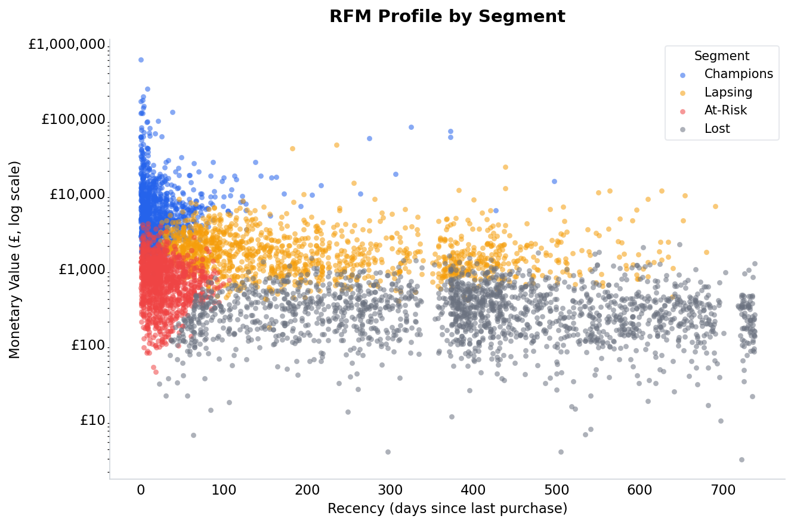
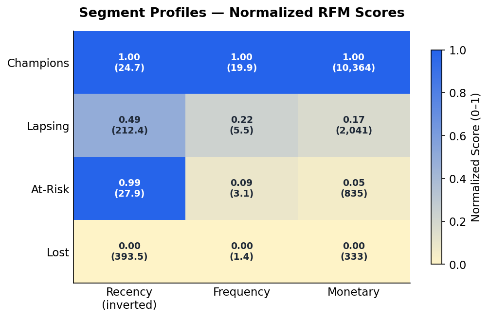
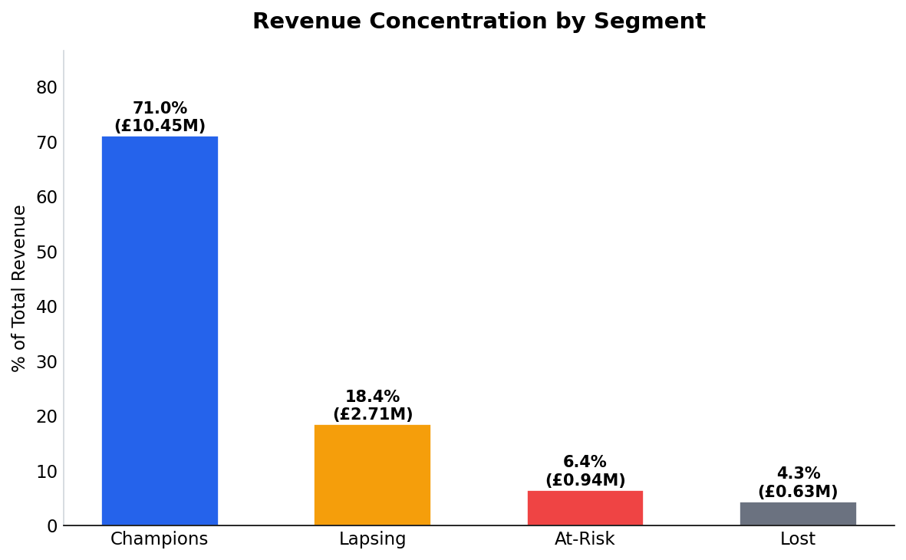

# E-commerce Customer Segmentation — RFM & K-Means Clustering

## Business Context

Not all customers are equal — a small group typically drives the majority of revenue, while a large silent majority slowly churns. This project segments customers of a UK-based online retailer to identify who the high-value buyers are, who is slipping away, and who has already left. The goal is to turn raw transaction data into actionable priorities for retention, winback, and nurturing campaigns.

---

## Dataset

| Attribute | Detail |
|---|---|
| Source | Online Retail II — UCI Machine Learning Repository (via Kaggle) |
| Size | ~1M transactions, reduced to 725,250 after cleaning |
| Date Range | December 2009 – December 2011 |
| Scope | UK customers only |

**Why UK only?** The UK accounts for 91.9% of all transactions. Including other countries would introduce noise from very small, behaviorally different customer bases that would distort the clusters.

---

## Methodology

### RFM Feature Engineering
Each customer is scored on three dimensions computed from their transaction history:

- **Recency** — days since their last purchase (lower = more engaged)
- **Frequency** — number of unique invoices placed
- **Monetary** — total spend in GBP (sum of `Quantity × Price`)

### Why Log-Transform?
All three RFM features are heavily right-skewed — a small number of wholesale accounts spend tens of thousands while most customers spend hundreds. Raw K-Means would cluster around outliers rather than natural behavioral groups. `log1p` compression followed by `StandardScaler` normalization brings the distributions into a usable shape.

### Why K = 4?
The elbow method was run for k = 2 to 10. K=4 sits at the inflection point in the inertia curve and achieves the second-highest silhouette score (0.370), just behind k=2 which is too coarse to be actionable. Four clusters map cleanly onto four distinct business realities: Champions, Lapsing, At-Risk, and Lost.



---

## Key Findings



- **Champions (18.8% of customers) generate 71% of total revenue** — a textbook Pareto effect. Losing even a small fraction of this group would be catastrophic to the bottom line.

- **35.4% of customers are Lost** — the largest single segment, with an average of 394 days since their last purchase. This is a silent retention crisis hiding in plain sight.

- **Lapsing customers (24.8%, £2.71M revenue) are the highest-priority winback target** — they have spending history and relationship depth, but their recency is slipping (avg 212 days). They are reachable before they become Lost.

- **At-Risk customers are recent but thin** — they bought recently (avg 28 days) but with low frequency (3.1 invoices) and modest spend (£835). Without nurturing, they will lapse before becoming loyal.





---

## Business Recommendations

| Segment | Action |
|---|---|
| **Champions** | Protect and reward — loyalty programs, early access, dedicated account management. Do not churn these customers. |
| **Lapsing** | Launch a targeted winback campaign — personalized email with product recommendations based on past purchases. Time-sensitive offer. |
| **At-Risk** | Nurture with low-friction engagement — welcome series, product education, small incentive on second purchase to build habit. |
| **Lost** | Minimal spend — broad reactivation email only. Accept that most will not return; reallocate budget to Lapsing. |

---

## Tools Used

| Tool | Purpose |
|---|---|
| Python 3 | Core language |
| pandas | Data loading, cleaning, and feature engineering |
| scikit-learn | K-Means clustering, StandardScaler |
| matplotlib | All visualizations |
| NumPy | Log-transform and numerical operations |

---

## Folder Structure

```
Ecommerce-rfm-analysis/
├── online_retail_II.csv          # Raw dataset
├── online_retail_cleaned.csv     # After cleaning (725,250 rows)
├── rfm.csv                       # RFM features per customer
├── rfm_clustered.csv             # RFM + cluster labels
├── visuals/
│   ├── elbow_curve.png
│   ├── finding1_segment_distribution.png
│   ├── finding2_rfm_scatter.png
│   ├── finding3_cluster_heatmap.png
│   └── finding4_revenue_concentration.png
├── CLAUDE.md
└── README.md
```
